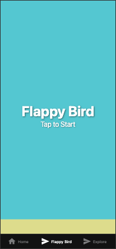
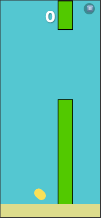
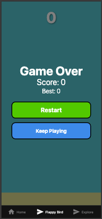

# Flappy Bird React Native

A Flappy Bird clone built with React Native and Expo.

## Screenshots

Here are some screenshots of the game in action:

### Start Screen


### Gameplay


### Game Over Screen


## Getting Started

1. Install dependencies

   ```bash
   npm install
   ```

2. Start the app

   ```bash
   npx expo start
   ```

In the output, you'll find options to open the app in a:

- [Development build](https://docs.expo.dev/develop/development-builds/introduction/)
- [Android emulator](https://docs.expo.dev/workflow/android-studio-emulator/)
- [iOS simulator](https://docs.expo.dev/workflow/ios-simulator/)
- [Expo Go](https://expo.dev/go)

## How to Play

- Tap the screen to make the bird flap its wings and fly upward
- Navigate through the pipes without hitting them
- Try to achieve the highest score possible!

## Technologies Used

- React Native
- Expo
- React Native Game Engine

## Learn More

To learn more about developing with Expo, check out the following resources:

- [Expo documentation](https://docs.expo.dev/)
- [React Native documentation](https://reactnative.dev/docs/getting-started)

## Get a fresh project

When you're ready, run:

```bash
npm run reset-project
```

This command will move the starter code to the **app-example** directory and create a blank **app** directory where you can start developing.

## Join the community

Join our community of developers creating universal apps.

- [Expo on GitHub](https://github.com/expo/expo): View our open source platform and contribute.
- [Discord community](https://chat.expo.dev): Chat with Expo users and ask questions.
